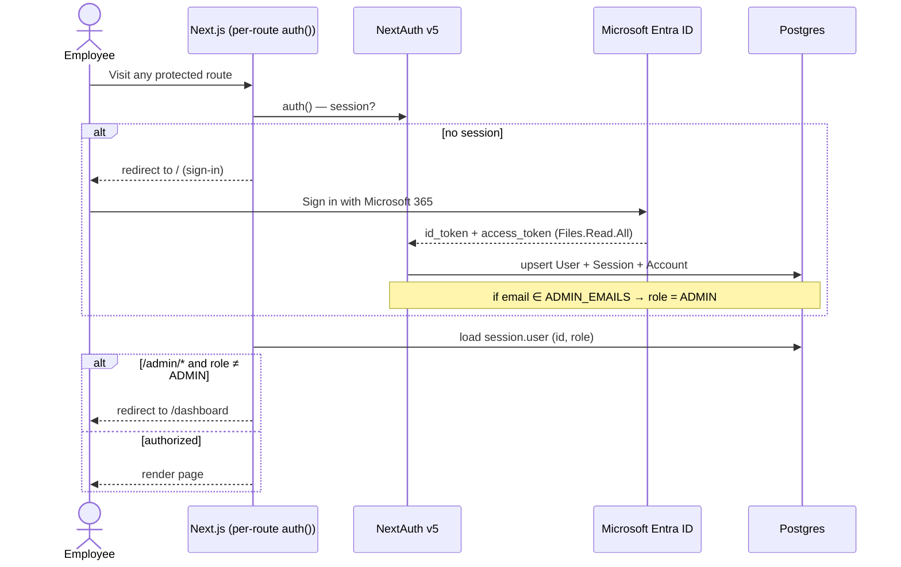
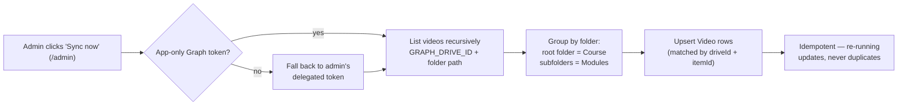
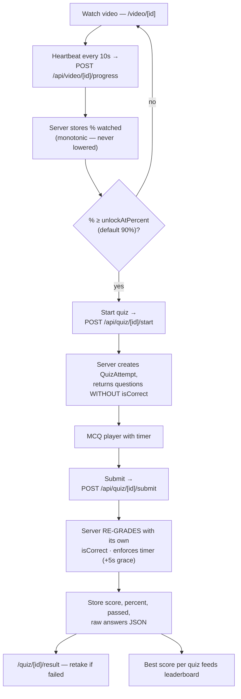
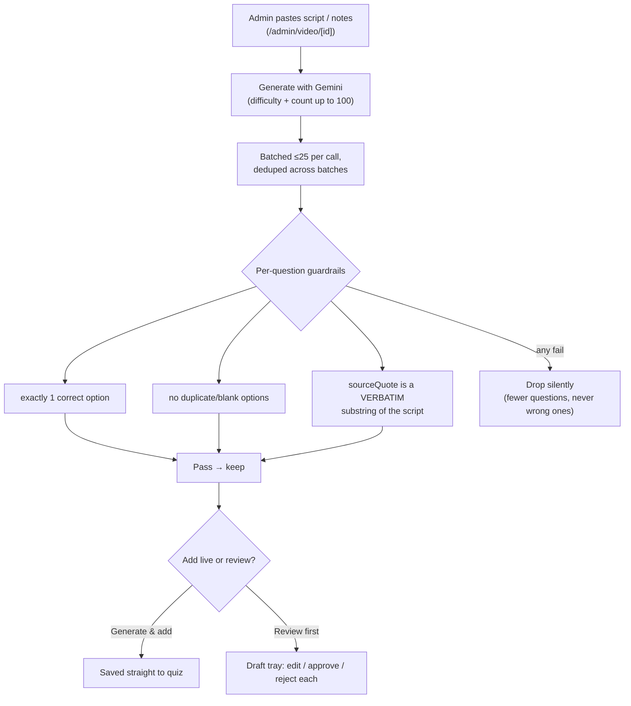
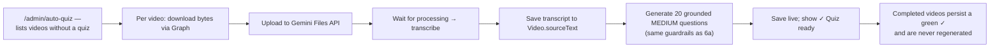
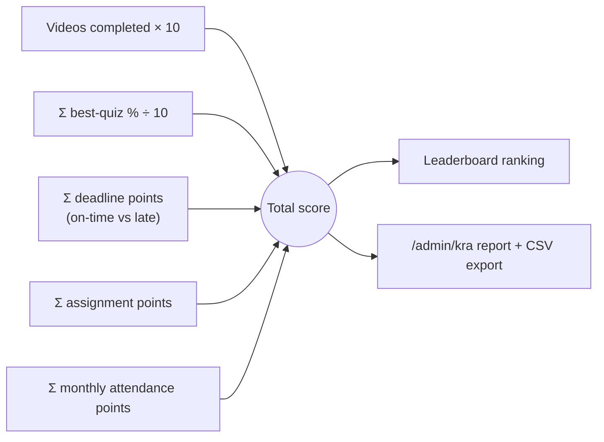
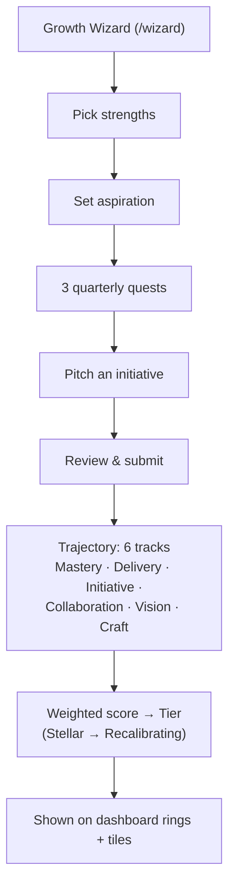
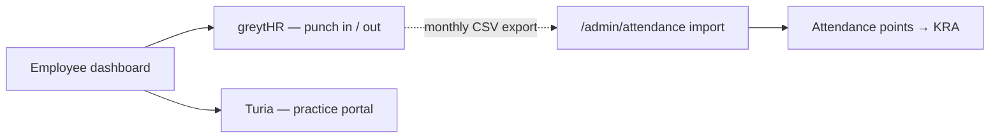

# Indefine LMS — Architecture & Flowcharts

This document is the visual map of the system: the site structure, how data flows,
and how each major feature works end to end. All diagrams are [Mermaid](https://mermaid.js.org/)
and render natively on GitHub.

> No secrets or credentials appear in this document. Every integration is referenced
> by its environment-variable **name** only (e.g. `GEMINI_API_KEY`), never a value.

---

## 1. Tech stack

| Layer | Technology |
|---|---|
| Framework | Next.js 15 (App Router, React 19, Server Components + Server Actions) |
| Language | TypeScript |
| Styling | Tailwind CSS |
| Database | PostgreSQL via Prisma ORM |
| Auth | NextAuth v5 (Auth.js) · Microsoft Entra ID (Azure AD) SSO · **database** sessions |
| Content | Microsoft Graph API → OneDrive / SharePoint video files |
| AI | Google Gemini API (quiz generation + video transcription) |
| Hosting | Railway (web service + Postgres) |

---

## 2. Site map

```mermaid
flowchart TD
    Root["/ (sign-in)"] -->|M365 SSO| Dash["/dashboard"]

    subgraph Employee["Employee area (any active user)"]
        Dash --> Video["/video/[id] — player + quiz gate"]
        Video --> Quiz["/quiz/[id] — MCQ player"]
        Quiz --> Result["/quiz/[id]/result"]
        Dash --> Leader["/leaderboard"]
        Dash --> Team["/team · /team/[userId] · /team/approvals"]
        Dash --> Initiatives["/initiatives"]
        Dash --> Checkin["/checkin · /checkin/history"]
        Dash --> Recap["/recap · /recap/year"]
        Dash --> Wizard["/wizard — strengths→aspiration→quests→initiative→review"]
    end

    subgraph Tools["/tools hub (any active user unless noted)"]
        Dash --> ToolsHome["/tools"]
        ToolsHome --> SOP["/tools/sop-builder — AI-drafted SOPs to Word"]
        ToolsHome --> Cert["/tools/certificate-generator — ICAI formats"]
        ToolsHome --> Office["/tools/office-tools — deeds, MOUs, GSTR-3B / TDS to Excel"]
        ToolsHome --> Neo["/tools/neo-centra — directors' incentive race (Partners only)"]
        ToolsHome --> Clients["/clients — client database, jobs, documents"]
    end

    Dash --> Work["/work — tech work tracker (email allow-list)"]

    subgraph Admin["Admin area (role = ADMIN)"]
        Dash --> AdminHome["/admin — overview + OneDrive sync"]
        AdminHome --> AVideo["/admin/video/[id] — quiz editor + AI"]
        AdminHome --> AutoQuiz["/admin/auto-quiz — bulk AI quizzes"]
        AdminHome --> Courses["/admin/courses — modules + deadlines"]
        AdminHome --> Assignments["/admin/assignments"]
        AdminHome --> Live["/admin/live — Teams sessions + recording ingest"]
        AdminHome --> TeamAdmin["/admin/team · /admin/branches"]
        AdminHome --> Trajectory["/admin/trajectory"]
        AdminHome --> Approvals["/admin/approvals"]
        AdminHome --> Checkins["/admin/checkins"]
        AdminHome --> Attendance["/admin/attendance — greytHR CSV import"]
        AdminHome --> KRA["/admin/kra · /admin/kra/[userId] — appraisal report + CSV"]
        AdminHome --> Settings["/admin/settings"]
    end

    Root -. external .-> GreytHR["greytHR (punch in/out)"]
    Root -. external .-> Turia["Turia (practice portal)"]
```



---

## 3. Authentication & access control

Sessions are stored in the **database** (not JWT) so role changes and revocations
take effect immediately, and the user's Graph token can be read server-side.



Every page and API enforces this in code: unauthenticated → redirect `/`;
non-admin hitting an admin route → redirect `/dashboard`; admin APIs return `401`.

**Who is who** is decided in one file, `src/lib/access.ts`:

| Predicate | Means | Set where |
|---|---|---|
| `isActive` | signed in and not deactivated by the org sync | `users-sync.ts` (licensed M365 members) |
| `isAdmin` | `role = ADMIN` | `ADMIN_EMAILS` on first sign-in, or `/admin/team` |
| `isPartner` | `level = PARTNER`, the firm's directors | `/admin/team` |
| `isManagement` | admin or partner | — |

Each module composes those into its own rule next to its code:

| Module | Rule file | Who gets in |
|---|---|---|
| Admin area | `src/app/admin/layout.tsx` | admins |
| Clients | `src/lib/clients/core.ts` | active users view/add; management edits; admins manage the service list |
| SOP Builder | `src/lib/sop/access.ts` | active users view; admins or granted editors author (editors only in their department) |
| Neo Centra | `src/lib/neo-centra/access.ts` | partners; admin-partners see everyone's detail |
| Certificates, Office Tools | `src/lib/certificates/access.ts`, `src/lib/office-tools/access.ts` | active users |
| Work tracker | `src/lib/work/core.ts` | emails in `WORK_TRACKER_EMAILS` (first one is the lead); everyone else gets 404 |

---

## 4. Content sync (OneDrive → database)

Videos are **never re-hosted**. The DB stores only metadata (drive id + item id);
each play resolves a fresh, short-lived stream URL via Graph.



A parallel **user sync** pulls the M365 tenant's enabled + licensed members into
the `User` table; anyone no longer licensed is marked `active = false` (never
hard-deleted, so history is preserved). Only `active` users appear in the KRA report
and leaderboard.

---

## 5. Watch → quiz → score (the core learning loop)



**Guardrail:** the client never receives correct answers and never reports its own
score — grading is entirely server-side.

---

## 6. AI quiz generation (Gemini)

Two ways to create quizzes, both grounded so questions can't be hallucinated.

### 6a. From a pasted script (admin video page)



### 6b. Auto-quiz from the video itself (bulk)



> Note: Gemini 2.5 "thinking" is disabled on these calls so the structured JSON
> isn't truncated, and the model name is auto-detected from the key to avoid
> "model not found" errors.

---

## 7. KRA / appraisal scoring

The leaderboard total and the appraisal report use one formula, computed over an
optional date window and **only for active users**.



**Course completion** (which drives deadline points): every video in every module
is completed **and** every attached quiz has a passing attempt; completion timestamp
is the latest of those events, compared against each `Deadline.dueAt`.

**Attendance points** come from the greytHR monthly CSV imported at `/admin/attendance`:
≥95% → 10 pts, ≥90% → 7, ≥80% → 4, below → 0.

---

## 8. Performance "Trajectory" layer



Weekly **check-ins**, **initiatives** (pitch → fund → ship), **endorsements**,
quarterly **snapshots**, and the year-end **Recap** all feed this layer.

---

## 9. External tools (from the dashboard)

The dashboard links out to two systems the firm already uses. Attendance from
greytHR is what flows back into KRA (via the monthly CSV import) — the links
themselves are just convenient access.



---

## 10. How the code is laid out

```
prisma/schema.prisma      one file, grouped by module with "// ---- Section ----" headers
src/lib/                  logic. Shared infra at the bottom, one folder per newer module
src/app/<area>/           pages (server components) + colocated "use client" panels
src/app/api/<area>/       route handlers (thin: auth → validate → call lib)
src/app/api/cron/<job>/   scheduled endpoints, all guarded by src/lib/cron-auth.ts
scripts/verify-*.ts       assert-based self-checks, run with `npm run verify:<name>`
docs/superpowers/         design specs and implementation plans for the newer modules
```

**Shared infrastructure** (`src/lib/*.ts`): `auth.ts` (NextAuth + Entra), `prisma.ts`,
`graph.ts` (Microsoft Graph: app-only and delegated tokens, drives, Teams, chats),
`gemini.ts`, `access.ts` (who is who), `ist.ts` (the firm's clock), `cron-auth.ts`,
`settings.ts` (singleton row), `ca-firm.ts` (departments, levels, labels).

**The original LMS core** (`src/lib/*.ts`, flat files): `sync.ts` and `users-sync.ts`
(OneDrive and Entra → DB), `quiz.ts` / `quiz-gen.ts` / `auto-quiz.ts` / `distill.ts` /
`transcribe.ts` (quiz pipeline), `live.ts` (Teams sessions, recording ingest, attendance),
`kra.ts` / `trajectory.ts` / `snapshots.ts` / `recap.ts` / `year-recap.ts` / `coaching.ts`
/ `gamification.ts` / `checkins.ts` / `assignments.ts` / `attendance.ts` (scoring layer).

**Module template** (every module added since mid-2026 follows it, and new work should too):

| Piece | Path | Rule |
|---|---|---|
| Pure rules | `src/lib/<module>/core.ts` | no Prisma, no fetch; everything here is asserted by the verify script |
| Access | `src/lib/<module>/access.ts` (or inside `core.ts`) | composes `src/lib/access.ts` |
| Database / storage | `src/lib/<module>/db.ts`, `storage.ts`, `service.ts` | every write in one transaction; nothing deletes user data |
| Routes | `src/app/api/<module>/**/route.ts` | auth → zod parse → one lib call → JSON |
| Pages | `src/app/<module>/**/page.tsx` + colocated panels | server component loads, `"use client"` panel calls the API |
| Schema | a `// ---- <Module> ----` section at the end of `prisma/schema.prisma` | additive only |
| Self-check | `scripts/verify-<module>.ts` + `npm run verify:<module>` | `node:assert/strict`, no framework |
| Design | `docs/superpowers/specs/<date>-<module>-design.md` and `plans/` | what was decided and why |

**Conventions that hold everywhere**

- Dates: IST only, through `src/lib/ist.ts`. Nothing else mentions `Asia/Kolkata`.
- Deletes: none on user data or SharePoint. "Obsolete", "inactive" or "archived" flags instead.
- Secrets: environment variables only; `.env.example` lists every one by name.
- Schema changes deploy through `prisma db push` on start (Railway); there are no migration files, so changes must be additive.
- Route handlers are the standard for new work; the older inline server actions (`"use server"`) remain in the wizard, check-in and approvals pages.

---

## 11. Modules

| Module | Entry | Logic | Schema section | Cron | Verify | Design |
|---|---|---|---|---|---|---|
| Learning core | `/dashboard`, `/video`, `/quiz`, `/admin` | `src/lib/*.ts` | Auth · Learning content · Quizzes · Deadlines / KRA · Assignments · Attendance · Trajectory · Live sessions | `/api/cron/live/ingest` | — | this document |
| Client onboarding | `/clients` | `src/lib/clients/` | Client onboarding | `/api/cron/clients` | `verify:clients` | `specs/2026-09-02-client-onboarding-design.md` |
| SOP Builder | `/tools/sop-builder` | `src/lib/sop/` | SOP Builder | — | — | — |
| Neo Centra | `/tools/neo-centra` | `src/lib/neo-centra/` | Neo Centra · Incentives | `/api/cron/neo-centra` | `verify:profit-split` | — |
| Office Tools | `/tools/office-tools` | `src/lib/office-tools/` | `OfficeToolRun` (audit) | — | `verify:office-tools` | — |
| Certificate generator | `/tools/certificate-generator` | `src/lib/certificates/` | `CertificateIssue`, `CertificateFieldOption` | — | `verify:certs` | — |
| Tech work tracker | `/work` | `src/lib/work/` | Tech work tracker | `/api/cron/work` | `verify:work` | `specs/2026-09-04-work-tracker-design.md` |

**Client onboarding (`/clients`).** Client master, admin-editable `ServiceType` per
department, `Job` per (client, service, FY) with status and due date, `ClientDocument`
rows pointing at SharePoint files under `<GRAPH_CLIENTS_ROOT>/<Client>/KYC` and
`<Client>/<FY>/<Department>/<Service>`. Postgres is the source of truth;
`workbook.ts` regenerates `_Database/Client Database.xlsx` in full after saves
(debounced), nightly, or from the button on `/clients/reports`.

**SOP Builder (`/tools/sop-builder`).** A plain description goes to Gemini
(`sop/gemini.ts`), comes back as a brief the author confirms, then `render.ts` builds a
department-tagged Word document that `storage.ts` saves to the L&D drive. `Sop` keeps
versions (`SopVersion`) and views; `SopEditor` grants let non-admins author within their
own department.

**Neo Centra (`/tools/neo-centra`).** The directors' cockpit. `turia.ts` reads the
practice-management system (Turia) with a stored session cookie (`NeoTuriaSession`);
`period.ts` fixes the quarter, `split.ts` computes profit and hours splits from
`NeoProfitSplit` / `NeoHoursSplit` / `NeoInternalBudget`, and `incentive.ts` freezes
each run into `NeoIncentiveSnapshot`. Partners only.

**Office Tools (`/tools/office-tools`).** `registry.ts` is the single list of tools;
each `tools/<name>.ts` holds a zod schema plus a generator. Legal documents (rental,
MOU, partnership, trust, LLP deeds, director's report) render to Word through
`docx.ts`; tax tools (`gstr3b.ts`, `tdsChallan.ts`) parse PDFs into Excel through
`pdf.ts` / `xlsx.ts`. Every run is logged in `OfficeToolRun` (`audit.ts`).

**Certificate generator (`/tools/certificate-generator`).** Twelve ICAI formats plus an
audit report and drafts, one file each under `certificates/templates/`, rendered
deterministically so any `CertificateIssue` can be re-downloaded identical.
`CertificateFieldOption` holds admin-curated dropdown values. Creator or admin may
download.

**Tech work tracker (`/work`).** Two-person focus tool. Work → Task; five statuses
(Ideas · Working · Paused · Done · Obsolete); weekly plan and daily pick gate; Friday
review with forced decisions on stale work; a board that moves itself from actions;
an append-only `WorkEvent` timeline. Rules in `work/core.ts`, every write in
`work/db.ts`, Teams nudges through the lead's delegated token in `work/teams.ts`.

---

## 12. Scheduled jobs

All cron endpoints accept `Authorization: Bearer $CRON_SECRET` (or `?key=`) and are
guarded by `src/lib/cron-auth.ts`. GitHub Actions calls them; the same secret lives on
Railway and as a repository Actions secret.

| Endpoint | Workflow | Schedule | What it does |
|---|---|---|---|
| `/api/cron/live/ingest` | `ingest-recordings.yml` | every 15 min | copy finished Teams recordings into L&D, publish, transcribe, quiz, capture attendance |
| `/api/cron/clients` | `clients-nightly.yml` | 02:00 IST | retry pending SharePoint folders, rebuild the client workbook |
| `/api/cron/work?job=morning\|friday\|close` | `work-nudges.yml` | 09:00 IST Mon–Fri · 16:00 IST Fri · 20:00 IST daily | Teams nudges; carry unfinished picks; auto-pause quiet work |
| `/api/cron/neo-centra` | none in this repo | manual or external | refresh Turia-fed incentive data |

---

## 13. Verification

There is no test framework. Each module's pure rules are asserted by a script:

```bash
npx tsc --noEmit
npm run verify:access      # role predicates
npm run verify:work        # IST clock, statuses, auto-done, kept-promise, gate
npm run verify:clients     # turnover bands, FY, names, workbook, reports
npm run verify:office-tools
npm run verify:certs
npm run verify:profit-split
npm run build
```

Run all of them before a push. `main` deploys to Railway on push.
