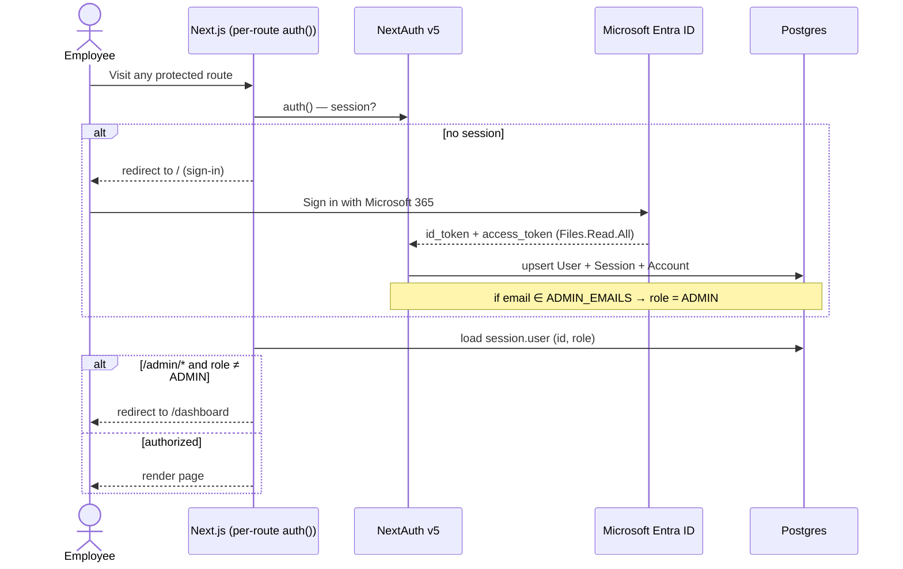
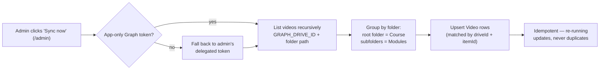
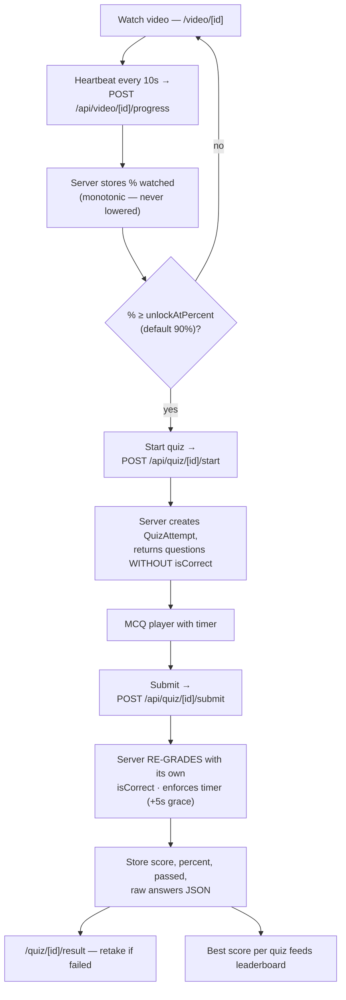
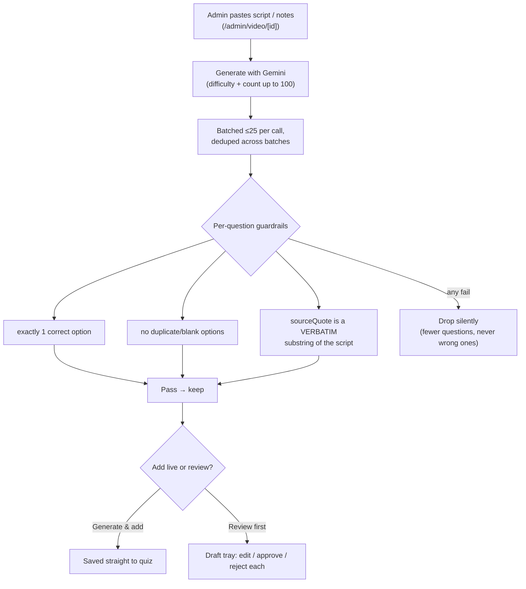
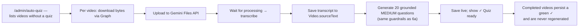
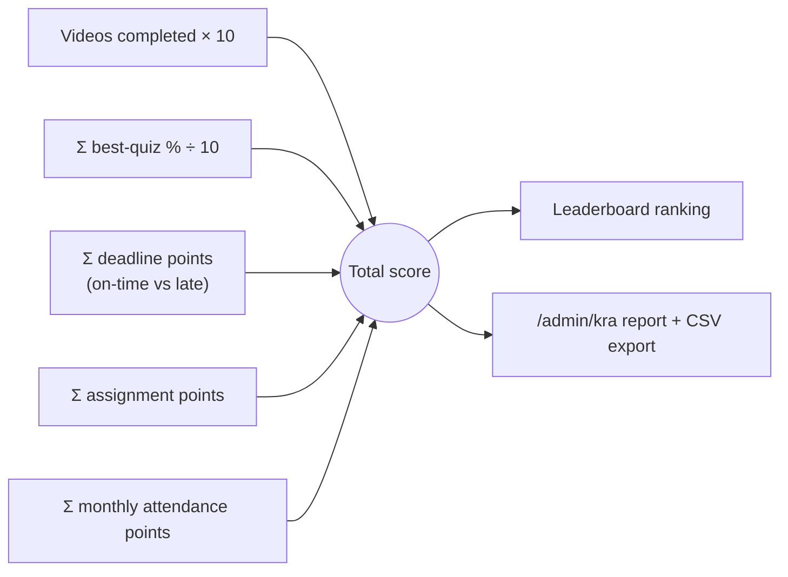
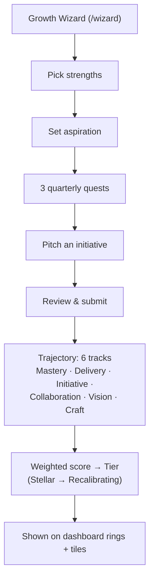
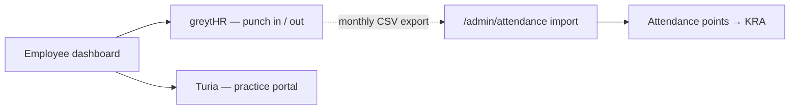

# Indefine LMS — Architecture & Flowcharts

This document is the visual map of the system: the site structure, how data flows,
and how each major feature works end to end. All diagrams are [Mermaid](https://mermaid.js.org/)
and render natively on GitHub.

> No secrets or credentials appear in this document. Every integration is referenced
> by its environment-variable **name** only (e.g. `GEMINI_API_KEY`), never a value.

---

## 1. Tech stack

| Layer | Technology |
|---|---|
| Framework | Next.js 15 (App Router, React 19, Server Components + Server Actions) |
| Language | TypeScript |
| Styling | Tailwind CSS |
| Database | PostgreSQL via Prisma ORM |
| Auth | NextAuth v5 (Auth.js) · Microsoft Entra ID (Azure AD) SSO · **database** sessions |
| Content | Microsoft Graph API → OneDrive / SharePoint video files |
| AI | Google Gemini API (quiz generation + video transcription) |
| Hosting | Railway (web service + Postgres) |

---

## 2. Site map

```mermaid
flowchart TD
    Root["/ (sign-in)"] -->|M365 SSO| Dash["/dashboard"]

    subgraph Employee["Employee area"]
        Dash --> Video["/video/[id] — player + quiz gate"]
        Video --> Quiz["/quiz/[id] — MCQ player"]
        Quiz --> Result["/quiz/[id]/result"]
        Dash --> Leader["/leaderboard"]
        Dash --> Team["/team · /team/[userId]"]
        Dash --> Initiatives["/initiatives"]
        Dash --> Checkin["/checkin · /checkin/history"]
        Dash --> Recap["/recap · /recap/year"]
        Dash --> Wizard["/wizard — strengths→aspiration→quests→initiative→review"]
    end

    subgraph Admin["Admin area (role = ADMIN)"]
        Dash --> AdminHome["/admin — overview + OneDrive sync"]
        AdminHome --> AVideo["/admin/video/[id] — quiz editor + AI"]
        AdminHome --> AutoQuiz["/admin/auto-quiz — bulk AI quizzes"]
        AdminHome --> Courses["/admin/courses — modules + deadlines"]
        AdminHome --> Assignments["/admin/assignments"]
        AdminHome --> TeamAdmin["/admin/team · /admin/branches"]
        AdminHome --> Trajectory["/admin/trajectory"]
        AdminHome --> Approvals["/admin/approvals"]
        AdminHome --> Checkins["/admin/checkins"]
        AdminHome --> Attendance["/admin/attendance — greytHR CSV import"]
        AdminHome --> KRA["/admin/kra · /admin/kra/[userId] — appraisal report + CSV"]
    end

    Root -. external .-> GreytHR["greytHR (punch in/out)"]
    Root -. external .-> Turia["Turia (practice portal)"]
```

---

## 3. Authentication & access control

Sessions are stored in the **database** (not JWT) so role changes and revocations
take effect immediately, and the user's Graph token can be read server-side.

Every page and API enforces this in code: unauthenticated → redirect `/`;
non-admin hitting an admin route → redirect `/dashboard`; admin APIs return `401`.

---

## 4. Content sync (OneDrive → database)

Videos are **never re-hosted**. The DB stores only metadata (drive id + item id);
each play resolves a fresh, short-lived stream URL via Graph.

A parallel **user sync** pulls the M365 tenant's enabled + licensed members into
the `User` table; anyone no longer licensed is marked `active = false` (never
hard-deleted, so history is preserved). Only `active` users appear in the KRA report
and leaderboard.

---

## 5. Watch → quiz → score (the core learning loop)

**Guardrail:** the client never receives correct answers and never reports its own
score — grading is entirely server-side.

---

## 6. AI quiz generation (Gemini)

Two ways to create quizzes, both grounded so questions can't be hallucinated.

### 6a. From a pasted script (admin video page)

### 6b. Auto-quiz from the video itself (bulk)

> Note: Gemini 2.5 "thinking" is disabled on these calls so the structured JSON
> isn't truncated, and the model name is auto-detected from the key to avoid
> "model not found" errors.

---

## 7. KRA / appraisal scoring

The leaderboard total and the appraisal report use one formula, computed over an
optional date window and **only for active users**.

**Course completion** (which drives deadline points): every video in every module
is completed **and** every attached quiz has a passing attempt; completion timestamp
is the latest of those events, compared against each `Deadline.dueAt`.

**Attendance points** come from the greytHR monthly CSV imported at `/admin/attendance`:
≥95% → 10 pts, ≥90% → 7, ≥80% → 4, below → 0.

---

## 8. Performance "Trajectory" layer

Weekly **check-ins**, **initiatives** (pitch → fund → ship), **endorsements**,
quarterly **snapshots**, and the year-end **Recap** all feed this layer.

---

## 9. External tools (from the dashboard)

The dashboard links out to two systems the firm already uses. Attendance from
greytHR is what flows back into KRA (via the monthly CSV import) — the links
themselves are just convenient access.

## Client onboarding (`/clients`)

Client master, admin-editable `ServiceType` per department, `Job` per (client, service, FY)
with status/due date, and `ClientDocument` rows pointing at files on SharePoint under
`<GRAPH_CLIENTS_ROOT>/<Client>/KYC` and `<Client>/<FY>/<Department>/<Service>`. Postgres is
the source of truth; `src/lib/clients/workbook.ts` regenerates
`<GRAPH_CLIENTS_ROOT>/_Database/Client Database.xlsx` in full (debounced after saves,
nightly via `/api/cron/clients`, or the button on `/clients/reports`). Nothing in this
module deletes from SharePoint. Pure helpers are checked by `npm run verify:clients`.
Design: `docs/superpowers/specs/2026-09-02-client-onboarding-design.md`.
